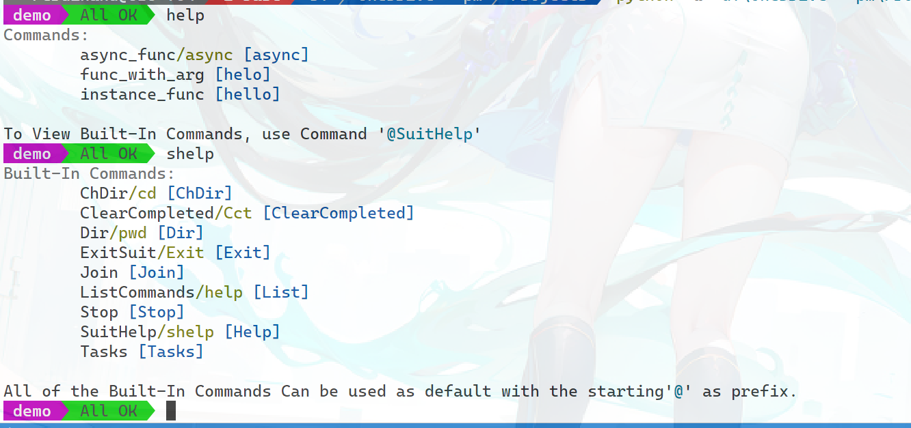

<div  align=center>
    
</div>

# PlasticMetal.(Py)MobileSuit


=

[View at PyPI](https://pypi.org/project/PyMobileSuit/)

MobileSuit provides an easy way to build Console App quickly. For python.

> This is the python version of [PlasticMetal.MobileSuit](https://github.com/Plastic-Metal/MobileSuit) (For .NET).

## Setup

```shell script
pip install PyMobileSuit
```

## Usage

There is a quite simple example:

```python
# [Import and Configure]
from PlasticMetal.MobileSuit import SuitInfo, Suit, SuitIgnore, SuitAlias, SuitConfig
SuitConfig.LOCALE = 'en'

# [Write Application Class]
class Hello(object):
    def __init__(self):
        pass

    @SuitInfo("hello")
    def instance_func(self):
        print("this is instance function")

    @SuitInfo("async")
    @SuitAlias("async")
    async def async_func(self):
        print("this is async func")

    @SuitInfo("helo")
    def func_with_arg(self, name: str):
        print(f"this is async func {name}")

    @SuitIgnore
    def ignored_func(self):
        print("this is func1")

# [Quick Start App]
Suit.QuickStart4BitPowerLine(Hello)
# Suit.QuickStart
# Suit.QuickStartPowerLine

# > type `help` after the prompt.
```

And this is the result:

<div  align=center>
    
</div>

### Import and Configure

`from PlasticMetal.MobileSuit import SuitInfo, Suit, SuitIgnore, SuitAlias, SuitConfig` is ALL YOU NEED normally.

There are two configurations for PyMobileSuit:

- LOCALE: `en` or `zh` to set language.
- THROW: To determine whether Exceptions caught from Application methods should be thrown. To debug your application, you may need to set `THROW=Ture`

### Write Application Class

Free to create your application class, write normal or asynchronous methods with or without parameters. Three basic decorators are available for your application methods:

- `@SuitInfo(expr: str, resourceType=None)`: `expr` is the description of the command shown in `help`command's output by default. If you also set `resourceType`, `getattr(resourceType,expr)` will be the description.
- `@SuitAlias(alias: str)`: Add aliases to the command besides the method name
- `@SuitIgnore`: Suppose the method is not a command.

### Quick Start App

Use `Suit.<QuickStartMethod>(<Your Class>)` to quickly start the application. There are three built-in `QuickStartMethod` implementations:

- Suit.QuickStart: Plain-text IO without powerline.
- Suit.QuickStartPowerLine: True color Powerline supported IO.
- Suit.QuickStart4BitPowerLine: ConsoleColor Powerline supported IO.

Normally, you should use `Suit.QuickStart` or `Suit.QuickStart4BitPowerLine`.

## Notice

Although MobileSuit is easy to use, its features are very comprehensive, so I haven't had the time to write complete documentation. 

The current version of PyMobileSuit is migrated from C # using ChatGPT and manual rather than rewritten so that it might be buggy, and that's why I had not published it on the pypi.

### KNOWN bugs (2023.7.21)

- Methods with args cannot be called as expected
